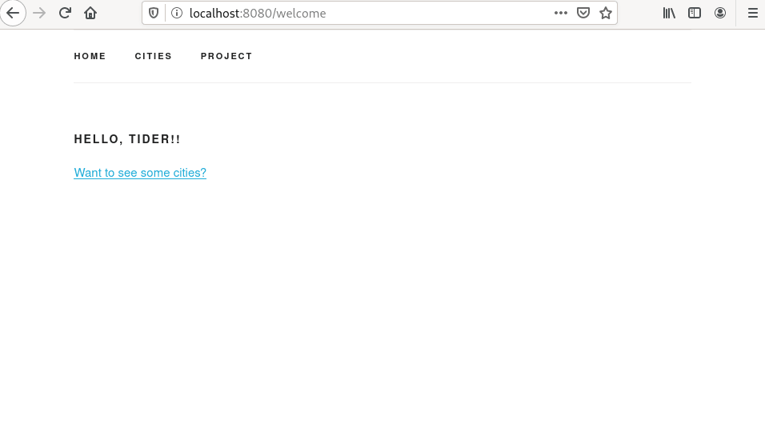

# tide-morth-example

An example application using mongodb rust tide and handlebars A.K.A MoRTH stack 

It's prime focus is to provde a project structure that should feel familiar to folks who have used JS Handlebars, pybars or Java Handlebars projects.



If you are evaluating tide patterns please look at [Rust Tide Example](https://github.com/jbr/tide-example).

Once this project has matured it's intended that it will enter the [Rust Tide Example Contributions](https://github.com/jbr/tide-example#contributing) section in some form.

## usage

This example requires a local mongo instance which can be ran with:

```
$ docker run -d -p 27017:27017 -v ~/data:/data/db mongo:4.2
```

If you wish to use a different mongodb please modify the [connection string in main.rs](https://github.com/No9/tide-morth-example/blob/master/src/main.rs#L21)

It also requires the options dependency of jaeger a local instance can be ran with:

```
$ docker run -d --name jaeger \
  -e COLLECTOR_ZIPKIN_HTTP_PORT=9411 \
  -p 5775:5775/udp \
  -p 6831:6831/udp \
  -p 6832:6832/udp \
  -p 5778:5778 \
  -p 16686:16686 \
  -p 14268:14268 \
  -p 14250:14250 \
  -p 9411:9411 \
  jaegertracing/all-in-one:1.18
```

Then start the app

```
$ cargo run
```

## Comments

* Fast development for simple CRUD apps as no data access layer is required just as a decorated struct - See models/cities.rs

```rust
use serde::{Deserialize, Serialize};
use wither::bson::{doc, oid::ObjectId};
use wither::prelude::*;

// Define a model. Simple as deriving a few traits.
#[derive(Debug, Model, Serialize, Deserialize)]
    pub struct City {
        #[serde(rename = "_id", skip_serializing_if = "Option::is_none")]
        pub id: Option<ObjectId>,
        #[model(index(index = "dsc", with(field = "country", index = "dsc")))]
        pub name: String,
        pub country: String,
        pub description: String,
    }
```

* Accessible to developers familiar with Javascript constructs

```html
    <tbody>
        {{#each cities}}
        <tr>
            <td>{{this._id.[$oid]}}</td>
            <td>{{this.name}}</td>
            <td>{{this.country}}</td>
            <td><a href="/cities/{{this._id.[$oid]}}"> Show </a></td>
            <td><a href="/cities/{{this._id.[$oid]}}/edit"> Edit </a></td>

        </tr>
        {{/each}}
    </tbody>
```
